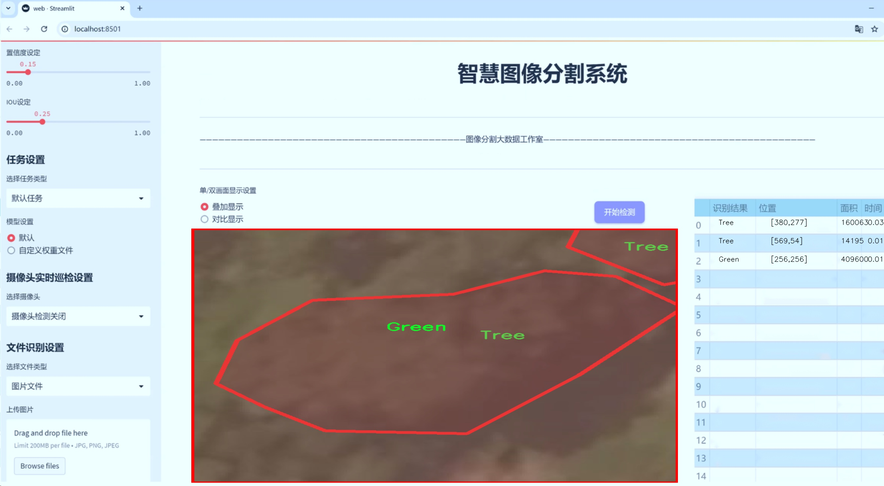
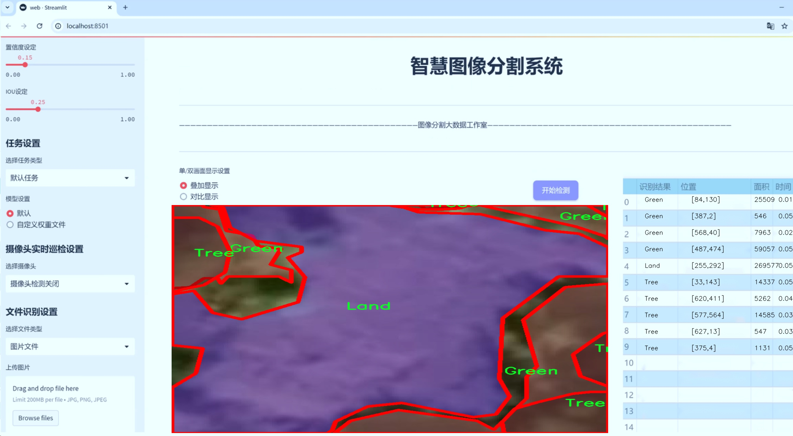
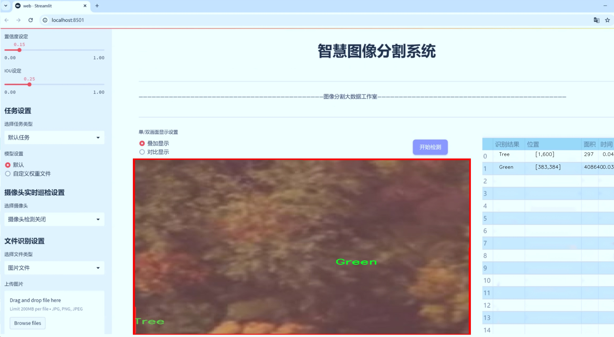
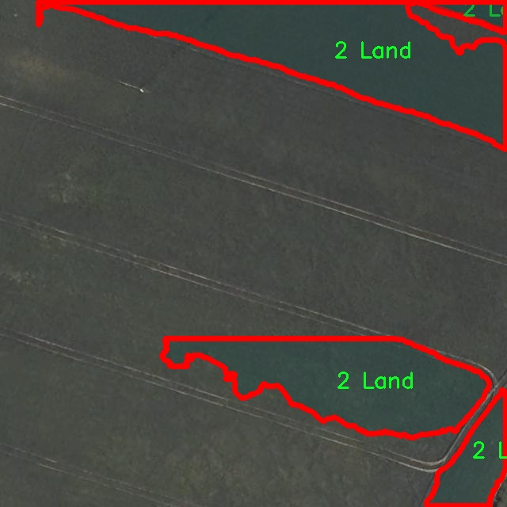
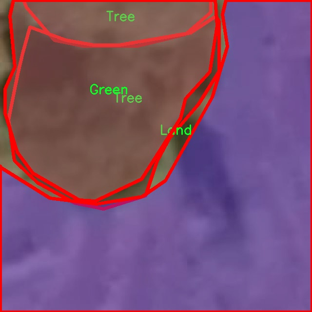
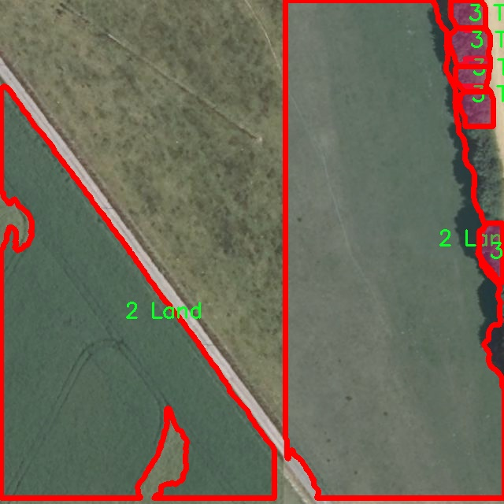
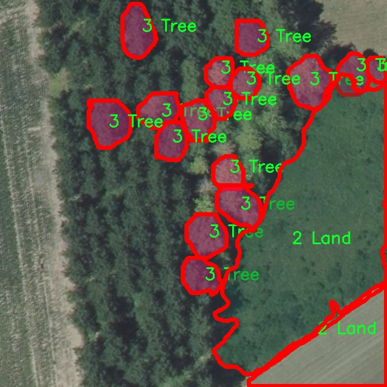
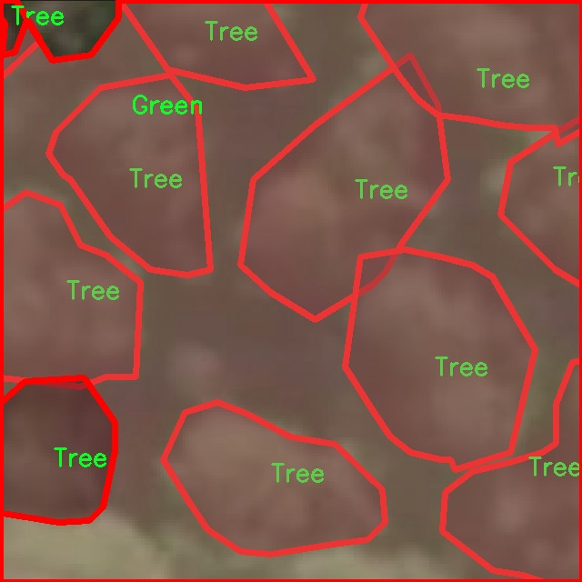

# 航拍区域图像分割系统源码＆数据集分享
 [yolov8-seg-C2f-DAttention＆yolov8-seg-HGNetV2等50+全套改进创新点发刊_一键训练教程_Web前端展示]

### 1.研究背景与意义

项目参考[ILSVRC ImageNet Large Scale Visual Recognition Challenge](https://gitee.com/YOLOv8_YOLOv11_Segmentation_Studio/projects)

项目来源[AAAI Global Al lnnovation Contest](https://kdocs.cn/l/cszuIiCKVNis)

研究背景与意义

随着无人机技术的迅猛发展，航拍图像在环境监测、城市规划、农业管理等领域的应用愈发广泛。航拍图像的高分辨率和大范围覆盖能力，使其成为获取地面信息的重要手段。然而，如何从海量的航拍图像中快速、准确地提取出有用的信息，尤其是进行区域图像分割，仍然是一个亟待解决的挑战。传统的图像处理方法往往依赖于人工标注和特征提取，效率低下且易受人为因素影响。因此，基于深度学习的图像分割技术逐渐成为研究热点，其中YOLO（You Only Look Once）系列模型因其高效性和实时性而备受关注。

YOLOv8作为YOLO系列的最新版本，结合了更先进的网络结构和训练策略，具有更强的特征提取能力和更高的分割精度。然而，针对特定领域的应用，YOLOv8仍然存在一些局限性，例如在复杂背景下的物体分割精度不足、对小物体的检测能力较弱等。因此，针对航拍图像的特点，对YOLOv8进行改进，以提升其在区域图像分割任务中的表现，具有重要的研究意义。

本研究围绕“树木与草地”这一特定场景展开，利用9300张高质量的航拍图像数据集进行训练和测试。该数据集包含9个类别，涵盖建筑、绿色植被、土地、水体等多种地物，能够为模型提供丰富的上下文信息。通过对这些类别的细致划分，研究不仅可以提高模型对不同地物的识别能力，还能为后续的环境监测和资源管理提供精确的数据支持。

在实际应用中，改进后的YOLOv8模型将能够实现对航拍图像中各类地物的快速分割与识别，为城市规划、生态监测等领域提供高效的解决方案。例如，在城市绿化管理中，能够快速识别和评估城市中的绿地分布情况；在农业管理中，能够监测作物生长状况，及时发现病虫害等问题。此外，基于该系统的实时数据分析能力，决策者可以更科学地制定管理措施，提高资源利用效率。

综上所述，基于改进YOLOv8的航拍区域图像分割系统的研究，不仅在理论上丰富了深度学习在图像分割领域的应用，还在实践中为环境保护、城市管理等提供了有效的技术支持。通过不断优化模型性能，提升其在复杂场景下的适应能力，最终实现高效、准确的航拍图像分析，推动相关领域的可持续发展。

### 2.图片演示







##### 注意：由于此博客编辑较早，上面“2.图片演示”和“3.视频演示”展示的系统图片或者视频可能为老版本，新版本在老版本的基础上升级如下：（实际效果以升级的新版本为准）

  （1）适配了YOLOV8的“目标检测”模型和“实例分割”模型，通过加载相应的权重（.pt）文件即可自适应加载模型。

  （2）支持“图片识别”、“视频识别”、“摄像头实时识别”三种识别模式。

  （3）支持“图片识别”、“视频识别”、“摄像头实时识别”三种识别结果保存导出，解决手动导出（容易卡顿出现爆内存）存在的问题，识别完自动保存结果并导出到tempDir中。

  （4）支持Web前端系统中的标题、背景图等自定义修改，后面提供修改教程。

  另外本项目提供训练的数据集和训练教程,暂不提供权重文件（best.pt）,需要您按照教程进行训练后实现图片演示和Web前端界面演示的效果。

### 3.视频演示

[3.1 视频演示](https://www.bilibili.com/video/BV1Acm3YfEFZ/)

### 4.数据集信息展示

##### 4.1 本项目数据集详细数据（类别数＆类别名）

nc: 6
names: ['1 Green', '2 Land', '3 Tree', 'Green', 'Land', 'Tree']


##### 4.2 本项目数据集信息介绍

数据集信息展示

在本研究中，我们采用了名为“trees and grassland”的数据集，以支持改进YOLOv8-seg的航拍区域图像分割系统的训练与验证。该数据集专注于自然环境中的植被和土地特征，旨在为计算机视觉任务提供丰富的样本和标注信息。数据集的设计考虑到了航拍图像的多样性和复杂性，确保了在不同光照、天气和季节条件下的有效性。

“trees and grassland”数据集包含六个类别，分别为“1 Green”、“2 Land”、“3 Tree”、“Green”、“Land”和“Tree”。这些类别的选择反映了自然环境中常见的元素，尤其是在森林和草地交错的区域。具体而言，“Green”类别主要指代覆盖在地面上的绿色植被，包括草地和其他低矮植物；“Land”类别则代表裸露的土地或土壤，通常在植被稀疏的区域中可见；而“Tree”类别则专注于树木的识别，涵盖了不同种类和形态的树木。

在数据集的构建过程中，考虑到了航拍图像的高分辨率和多样性，确保了每个类别的样本都能在不同的环境背景下进行有效标注。这种多样性不仅提高了模型的泛化能力，也为后续的图像分割任务提供了丰富的训练数据。通过精确的标注，研究人员能够有效地训练YOLOv8-seg模型，使其在处理复杂的自然场景时，能够准确地识别和分割出不同的区域。

数据集的每个类别都经过精心挑选，以确保其在实际应用中的相关性和重要性。例如，识别“Tree”类别对于森林管理和生态监测至关重要，而“Land”类别则有助于土地利用分析和环境变化监测。此外，“Green”类别的识别可以为农业管理和植被覆盖变化研究提供重要数据支持。通过对这些类别的深入分析，研究人员能够更好地理解生态系统的动态变化，从而为环境保护和可持续发展提供科学依据。

在训练过程中，数据集的多样性和丰富性将使得YOLOv8-seg模型能够学习到更为复杂的特征和模式，从而提升其在实际应用中的表现。随着模型的不断优化，我们期望能够实现更高的分割精度和更快的处理速度，以满足航拍图像分析的需求。

总之，“trees and grassland”数据集为改进YOLOv8-seg的航拍区域图像分割系统提供了坚实的基础。通过对六个类别的深入研究和分析，研究人员不仅能够提高模型的性能，还能为相关领域的研究提供重要的数据支持。未来，我们期待通过进一步的实验和数据扩展，推动这一领域的发展，为生态监测、土地管理和环境保护等实际应用提供更为有效的解决方案。











### 5.全套项目环境部署视频教程（零基础手把手教学）

[5.1 环境部署教程链接（零基础手把手教学）](https://www.bilibili.com/video/BV1jG4Ve4E9t/?vd_source=bc9aec86d164b67a7004b996143742dc)


[5.2 安装Python虚拟环境创建和依赖库安装视频教程链接（零基础手把手教学）](https://www.bilibili.com/video/BV1nA4VeYEze/?vd_source=bc9aec86d164b67a7004b996143742dc)

### 6.手把手YOLOV8-seg训练视频教程（零基础小白有手就能学会）

[6.1 手把手YOLOV8-seg训练视频教程（零基础小白有手就能学会）](https://www.bilibili.com/video/BV1cA4VeYETe/?vd_source=bc9aec86d164b67a7004b996143742dc)


按照上面的训练视频教程链接加载项目提供的数据集，运行train.py即可开始训练



     Epoch   gpu_mem       box       obj       cls    labels  img_size
     1/200     0G   0.01576   0.01955  0.007536        22      1280: 100%|██████████| 849/849 [14:42<00:00,  1.04s/it]
               Class     Images     Labels          P          R     mAP@.5 mAP@.5:.95: 100%|██████████| 213/213 [01:14<00:00,  2.87it/s]
                 all       3395      17314      0.994      0.957      0.0957      0.0843

     Epoch   gpu_mem       box       obj       cls    labels  img_size
     2/200     0G   0.01578   0.01923  0.007006        22      1280: 100%|██████████| 849/849 [14:44<00:00,  1.04s/it]
               Class     Images     Labels          P          R     mAP@.5 mAP@.5:.95: 100%|██████████| 213/213 [01:12<00:00,  2.95it/s]
                 all       3395      17314      0.996      0.956      0.0957      0.0845

     Epoch   gpu_mem       box       obj       cls    labels  img_size
     3/200     0G   0.01561    0.0191  0.006895        27      1280: 100%|██████████| 849/849 [10:56<00:00,  1.29it/s]
               Class     Images     Labels          P          R     mAP@.5 mAP@.5:.95: 100%|███████   | 187/213 [00:52<00:00,  4.04it/s]
                 all       3395      17314      0.996      0.957      0.0957      0.0845


### 7.50+种全套YOLOV8-seg创新点代码加载调参视频教程（一键加载写好的改进模型的配置文件）

[7.1 50+种全套YOLOV8-seg创新点代码加载调参视频教程（一键加载写好的改进模型的配置文件）](https://www.bilibili.com/video/BV1Hw4VePEXv/?vd_source=bc9aec86d164b67a7004b996143742dc)

### 8.YOLOV8-seg图像分割算法原理

原始YOLOV8-seg算法原理

YOLOv8-seg是2023年由Ultralytics推出的一款先进的目标检测与分割模型，它不仅继承了YOLO系列的优良传统，还融合了多种前沿技术，形成了一种高效、准确的视觉识别解决方案。YOLOv8-seg的设计理念在于实现实时检测与分割的完美结合，使其在复杂的应用场景中表现出色，尤其是在农业、自动驾驶等领域，具有广泛的应用潜力。

YOLOv8-seg的核心结构由输入层、主干网络、颈部网络和头部网络四个主要组件构成。输入层负责将原始图像缩放至模型所需的尺寸，确保数据的一致性和有效性。接下来，主干网络通过一系列卷积操作对图像进行特征提取。与前代YOLO模型相比，YOLOv8-seg在主干网络中采用了C2f模块替代了YOLOv5中的C3模块，显著提升了特征提取的效率和效果。C2f模块通过跨层连接的方式增强了模型的梯度流动性，使得深层特征的学习更加高效，进而改善了检测和分割的精度。

在特征提取的过程中，YOLOv8-seg还引入了CSP结构（Cross Stage Partial），将特征提取过程分为两部分，分别进行卷积和连接。这种设计不仅减少了计算量，还有效防止了梯度消失的问题。主干网络的末尾使用了SPPF（Spatial Pyramid Pooling Fast）模块，该模块通过多个最大池化层的组合，增强了模型对多尺度特征的处理能力，使得YOLOv8-seg在面对不同尺寸目标时，依然能够保持良好的检测和分割性能。

颈部网络是YOLOv8-seg的另一个重要组成部分，它采用了PAN-FPN（Path Aggregation Network - Feature Pyramid Network）结构，以实现多尺度特征的融合。通过将不同层次的特征图进行组合，颈部网络能够有效整合来自主干网络的多层信息，增强了模型对复杂场景的理解能力。这种特征融合的策略使得YOLOv8-seg在处理细节丰富的图像时，能够更好地捕捉到目标的边界和形状，从而提高分割的精度。

在头部网络中，YOLOv8-seg采用了解耦的检测头结构，通过两个并行的卷积分支分别计算目标的回归和分类损失。这种设计使得模型在进行目标检测的同时，能够有效地进行实例分割，极大地提升了模型的功能性和适用性。值得注意的是，YOLOv8-seg使用了Anchor-Free的检测方式，这一创新的检测策略使得模型在处理目标时不再依赖于预定义的锚框，从而减少了模型的复杂性，提高了检测的灵活性。

在损失函数的设计上，YOLOv8-seg使用了CloU（Class-aware Localization Uncertainty）损失函数，这一损失函数不仅考虑了目标的类别信息，还引入了定位不确定性，使得模型在训练过程中能够更好地平衡检测精度与召回率。这种损失函数的设计理念在于，通过引入不确定性因素，模型能够在面对模糊或重叠目标时，依然保持较高的检测和分割性能。

YOLOv8-seg的实时性能也是其一大亮点。得益于其高效的网络结构和优化的计算流程，YOLOv8-seg能够在保持高精度的同时，实现实时的目标检测与分割。这一特性使得YOLOv8-seg在诸如自动驾驶、无人机监控、智能农业等应用场景中，具备了极大的实用价值。例如，在苹果采摘的应用中，YOLOv8-seg能够快速、准确地识别和定位苹果，为自动采摘机器人提供必要的视觉信息，进而提高采摘效率和准确性。

综上所述，YOLOv8-seg通过其创新的网络结构、灵活的检测策略和高效的损失函数设计，成功地将目标检测与实例分割结合在一起，形成了一种高效、准确的视觉识别模型。其在实时性和精度上的双重优势，使得YOLOv8-seg在各类复杂应用场景中展现出强大的能力，预示着目标检测与分割领域的一次重要技术进步。随着YOLOv8-seg的不断发展与应用，未来的视觉识别技术将迎来更加广阔的前景。


### 9.系统功能展示（检测对象为举例，实际内容以本项目数据集为准）

图9.1.系统支持检测结果表格显示

  图9.2.系统支持置信度和IOU阈值手动调节

  图9.3.系统支持自定义加载权重文件best.pt(需要你通过步骤5中训练获得)

  图9.4.系统支持摄像头实时识别

  图9.5.系统支持图片识别

  图9.6.系统支持视频识别

  图9.7.系统支持识别结果文件自动保存

  图9.8.系统支持Excel导出检测结果数据


### 10.50+种全套YOLOV8-seg创新点原理讲解（非科班也可以轻松写刊发刊，V11版本正在科研待更新）

#### 10.1 由于篇幅限制，每个创新点的具体原理讲解就不一一展开，具体见下列网址中的创新点对应子项目的技术原理博客网址【Blog】：


[10.1 50+种全套YOLOV8-seg创新点原理讲解链接](https://gitee.com/qunmasj/good)

#### 10.2 部分改进模块原理讲解(完整的改进原理见上图和技术博客链接)【如果此小节的图加载失败可以通过CSDN或者Github搜索该博客的标题访问原始博客，原始博客图片显示正常】

### YOLOv8简介
YoloV8模型结构
YOLOv3之前的所有YOLO对象检测模型都是用C语言编写的，并使用了Darknet框架，Ultralytics发布了第一个使用PyTorch框架实现的YOLO (YOLOv3)；YOLOv3之后，Ultralytics发布了YOLOv5，在2023年1月，Ultralytics发布了YOLOv8，包含五个模型，用于检测、分割和分类。 YOLOv8 Nano是其中最快和最小的，而YOLOv8 Extra Large (YOLOv8x)是其中最准确但最慢的，具体模型见后续的图。

YOLOv8附带以下预训练模型:

目标检测在图像分辨率为640的COCO检测数据集上进行训练。
实例分割在图像分辨率为640的COCO分割数据集上训练。
图像分类模型在ImageNet数据集上预训练，图像分辨率为224。
YOLOv8 概述
具体到 YOLOv8 算法，其核心特性和改动可以归结为如下：

提供了一个全新的SOTA模型（state-of-the-art model），包括 P5 640 和 P6 1280 分辨率的目标检测网络和基于YOLACT的实例分割模型。和 YOLOv5 一样，基于缩放系数也提供了 N/S/M/L/X 尺度的不同大小模型，用于满足不同场景需求
骨干网络和 Neck 部分可能参考了 YOLOv7 ELAN 设计思想，将 YOLOv5 的 C3 结构换成了梯度流更丰富的 C2f 结构，并对不同尺度模型调整了不同的通道数，属于对模型结构精心微调，不再是一套参数应用所有模型，大幅提升了模型性能。
Head 部分相比 YOLOv5 改动较大，换成了目前主流的解耦头结构，将分类和检测头分离，同时也从Anchor-Based 换成了 Anchor-Free
Loss 计算方面采用了TaskAlignedAssigner正样本分配策略，并引入了Distribution Focal Loss
训练的数据增强部分引入了 YOLOX 中的最后 10 epoch 关闭 Mosiac 增强的操作，可以有效地提升精度


### HRNet V2简介
现在设计高低分辨率融合的思路主要有以下四种：


（a）对称结构。如U-Net、Hourglass等，都是先下采样再上采样，上下采样过程对称。

（b）级联金字塔。如refinenet等，高低分辨率融合时经过卷积处理。

（c）简单的baseline，用转职卷积进行上采样。

（d）扩张卷积。如deeplab等，增大感受野，减少下采样次数，可以无需跳层连接直接进行上采样。

（b）（c）都是使用复杂一些的网络进行下采样（如resnet、vgg），再用轻量级的网络进行上采样。

HRNet V1是在（b）的基础上进行改进，从头到尾保持大的分辨率表示。然而HRNet V1仅是用在姿态估计领域的，HRNet V2对它做小小的改进可以使其适用于更广的视觉任务。这一改进仅仅增加了较小的计算开销，但却提升了较大的准确度。

#### 网络结构图：


这个结构图简洁明了就不多介绍了，首先图2的输入是已经经过下采样四倍的feature map，横向的conv block指的是basicblock 或 bottleblock，不同分辨率之间的多交叉线部分是multi-resolution convolution（多分辨率组卷积）。

到此为止HRNet V2和HRNet V1是完全一致的。

区别之处在于这个基网络上加的一个head：


图3介绍的是接在图2最后的head。（a）是HRNet V1的头，很明显他只用了大分辨率的特征图。（b）（c）是HRNet V2的创新点，（b）用与语义分割，（c）用于目标检测。除此之外作者还在实验部分介绍了用于分类的head，如图4所示。


#### 多分辨率block：


一个多分辨率block由多分辨率组卷积（a）和多分辨率卷积（b）组成。（c）是一个正常卷积的展开，（b）的灵感来源于（c）。代码中（a）部分由Bottleneck和BasicBlock组成。

多分辨率卷积和正常卷积的区别：（1）多分辨率卷积中，每个通道的subset的分辨率都不一样。（2）通道之间的连接如果是降分辨率，则用的是3x3的2stride的卷积，如果是升分辨率，用的是双线性最邻近插值上采样。


### 11.项目核心源码讲解（再也不用担心看不懂代码逻辑）

#### 11.1 ultralytics\hub\auth.py

以下是经过简化和注释的核心代码部分，保留了最重要的功能和逻辑：

```python
import requests
from ultralytics.hub.utils import HUB_API_ROOT, request_with_credentials
from ultralytics.utils import LOGGER, SETTINGS, is_colab

API_KEY_URL = f'{HUB_WEB_ROOT}/settings?tab=api+keys'

class Auth:
    """
    处理身份验证过程，包括API密钥管理和基于cookie的身份验证。
    """
    id_token = api_key = False  # 初始化身份验证令牌和API密钥

    def __init__(self, api_key='', verbose=False):
        """
        初始化Auth类，接受可选的API密钥。

        Args:
            api_key (str, optional): API密钥或组合API密钥和模型ID。
        """
        # 处理API密钥，保留第一部分
        api_key = api_key.split('_')[0]
        self.api_key = api_key or SETTINGS.get('api_key', '')

        # 如果提供了API密钥
        if self.api_key:
            if self.api_key == SETTINGS.get('api_key'):
                if verbose:
                    LOGGER.info('已认证 ✅')
                return
            else:
                success = self.authenticate()  # 尝试认证
        elif is_colab():  # 如果在Google Colab环境中
            success = self.auth_with_cookies()  # 尝试使用cookie认证
        else:
            success = self.request_api_key()  # 请求API密钥

        # 更新设置并记录认证状态
        if success:
            SETTINGS.update({'api_key': self.api_key})
            if verbose:
                LOGGER.info('新认证成功 ✅')
        elif verbose:
            LOGGER.info(f'从 {API_KEY_URL} 获取API密钥')

    def request_api_key(self, max_attempts=3):
        """
        提示用户输入API密钥。

        Returns:
            bool: 认证成功返回True。
        """
        import getpass
        for attempts in range(max_attempts):
            LOGGER.info(f'登录尝试 {attempts + 1} / {max_attempts}')
            input_key = getpass.getpass(f'输入API密钥: ')
            self.api_key = input_key.split('_')[0]  # 去掉模型ID
            if self.authenticate():
                return True
        raise ConnectionError('认证失败 ❌')

    def authenticate(self) -> bool:
        """
        尝试使用id_token或API密钥进行认证。

        Returns:
            bool: 认证成功返回True，失败返回False。
        """
        try:
            header = self.get_auth_header()  # 获取认证头
            if header:
                r = requests.post(f'{HUB_API_ROOT}/v1/auth', headers=header)
                if not r.json().get('success', False):
                    raise ConnectionError('无法认证。')
                return True
            raise ConnectionError('用户未在本地认证。')
        except ConnectionError:
            self.id_token = self.api_key = False  # 重置无效状态
            LOGGER.warning('无效的API密钥 ⚠️')
            return False

    def auth_with_cookies(self) -> bool:
        """
        尝试通过cookie进行认证。

        Returns:
            bool: 认证成功返回True，失败返回False。
        """
        if not is_colab():
            return False  # 仅在Colab中有效
        try:
            authn = request_with_credentials(f'{HUB_API_ROOT}/v1/auth/auto')
            if authn.get('success', False):
                self.id_token = authn.get('data', {}).get('idToken', None)
                self.authenticate()
                return True
            raise ConnectionError('无法获取浏览器认证信息。')
        except ConnectionError:
            self.id_token = False  # 重置无效状态
            return False

    def get_auth_header(self):
        """
        获取用于API请求的认证头。

        Returns:
            dict: 认证头，如果未设置id_token或API密钥则返回None。
        """
        if self.id_token:
            return {'authorization': f'Bearer {self.id_token}'}
        elif self.api_key:
            return {'x-api-key': self.api_key}
        return None  # 如果都没有则返回None
```

### 代码分析
1. **Auth类**：负责处理用户的身份验证，包括通过API密钥或cookie进行认证。
2. **构造函数**：根据传入的API密钥或在Colab环境中尝试自动认证，最终更新设置。
3. **request_api_key方法**：提示用户输入API密钥，并进行认证。
4. **authenticate方法**：使用API密钥或id_token尝试与服务器进行认证。
5. **auth_with_cookies方法**：在Colab环境中尝试通过浏览器cookie进行认证。
6. **get_auth_header方法**：根据当前的认证状态返回适当的请求头。 

以上代码经过简化，保留了核心功能并添加了详细的中文注释，便于理解和维护。

这个文件是一个用于管理身份验证的Python类，主要用于与Ultralytics的API进行交互。文件中包含了一个名为`Auth`的类，该类负责处理API密钥的管理、基于cookie的身份验证以及生成请求头。类的设计支持多种身份验证方式，包括直接使用API密钥、使用浏览器cookie进行身份验证（特别是在Google Colab环境中），以及提示用户输入API密钥。

在类的属性中，`id_token`、`api_key`和`model_key`都是初始化为`False`，用于存储身份验证所需的令牌和密钥。构造函数`__init__`接受一个可选的API密钥参数，并在初始化时进行处理。如果提供了API密钥，程序会检查该密钥是否与设置中的密钥匹配。如果匹配，则记录用户已登录的信息；如果不匹配，则尝试使用提供的API密钥进行身份验证。如果没有提供API密钥且当前环境是Google Colab，程序会尝试通过浏览器cookie进行身份验证；否则，它会请求用户输入API密钥。

`request_api_key`方法用于提示用户输入API密钥，最多允许三次尝试。如果用户输入的密钥有效，则返回成功；否则，抛出连接错误。`authenticate`方法尝试使用`id_token`或API密钥与服务器进行身份验证，并返回是否成功的布尔值。如果身份验证失败，则会重置无效的密钥并记录警告信息。

`auth_with_cookies`方法专门用于在Google Colab环境中通过cookie进行身份验证。它尝试获取浏览器的身份验证信息，如果成功，则会设置`id_token`并调用`authenticate`方法进行进一步验证。

最后，`get_auth_header`方法用于生成API请求所需的身份验证头。如果`id_token`或`api_key`已设置，则返回相应的头部信息；否则返回`None`。

总体而言，这个文件提供了一种灵活的方式来处理与Ultralytics API的身份验证，确保用户能够安全地访问所需的资源。

#### 11.2 ultralytics\nn\tasks.py

以下是经过简化和注释的核心代码部分，主要包括模型的基本结构和前向传播的逻辑：

```python
import torch
import torch.nn as nn

class BaseModel(nn.Module):
    """BaseModel类是Ultralytics YOLO系列模型的基类。"""

    def forward(self, x, *args, **kwargs):
        """
        模型的前向传播方法，处理单个尺度的输入。

        参数:
            x (torch.Tensor | dict): 输入图像张量或包含图像张量和真实标签的字典。

        返回:
            (torch.Tensor): 网络的输出。
        """
        if isinstance(x, dict):  # 处理训练和验证时的情况
            return self.loss(x, *args, **kwargs)  # 计算损失
        return self.predict(x, *args, **kwargs)  # 进行预测

    def predict(self, x, profile=False, visualize=False, augment=False):
        """
        通过网络进行前向传播。

        参数:
            x (torch.Tensor): 输入张量。
            profile (bool): 如果为True，打印每层的计算时间，默认为False。
            visualize (bool): 如果为True，保存模型的特征图，默认为False。
            augment (bool): 在预测时进行图像增强，默认为False。

        返回:
            (torch.Tensor): 模型的最后输出。
        """
        if augment:
            return self._predict_augment(x)  # 进行增强预测
        return self._predict_once(x, profile, visualize)  # 进行一次预测

    def _predict_once(self, x, profile=False, visualize=False):
        """
        执行一次前向传播。

        参数:
            x (torch.Tensor): 输入张量。
            profile (bool): 如果为True，打印每层的计算时间，默认为False。
            visualize (bool): 如果为True，保存模型的特征图，默认为False。

        返回:
            (torch.Tensor): 模型的最后输出。
        """
        y, dt = [], []  # 输出列表和时间记录
        for m in self.model:  # 遍历模型中的每一层
            if m.f != -1:  # 如果不是来自前一层
                x = y[m.f] if isinstance(m.f, int) else [x if j == -1 else y[j] for j in m.f]  # 从早期层获取输入
            if profile:
                self._profile_one_layer(m, x, dt)  # 记录当前层的计算时间
            x = m(x)  # 执行当前层的前向传播
            y.append(x if m.i in self.save else None)  # 保存输出
            if visualize:
                feature_visualization(x, m.type, m.i, save_dir=visualize)  # 可视化特征图
        return x  # 返回最后的输出

    def loss(self, batch, preds=None):
        """
        计算损失。

        参数:
            batch (dict): 用于计算损失的批次数据。
            preds (torch.Tensor | List[torch.Tensor]): 预测结果。

        返回:
            (torch.Tensor): 计算得到的损失值。
        """
        if not hasattr(self, 'criterion'):
            self.criterion = self.init_criterion()  # 初始化损失函数

        preds = self.forward(batch['img']) if preds is None else preds  # 进行前向传播
        return self.criterion(preds, batch)  # 计算损失

    def init_criterion(self):
        """初始化BaseModel的损失标准。"""
        raise NotImplementedError('compute_loss() needs to be implemented by task heads')

# DetectionModel类继承自BaseModel，表示YOLOv8检测模型
class DetectionModel(BaseModel):
    """YOLOv8检测模型。"""

    def __init__(self, cfg='yolov8n.yaml', ch=3, nc=None, verbose=True):
        """初始化YOLOv8检测模型。"""
        super().__init__()
        # 这里省略了配置文件的加载和模型的构建过程
        # 例如：self.model, self.save = parse_model(...)

    def init_criterion(self):
        """初始化检测模型的损失标准。"""
        return v8DetectionLoss(self)  # 返回特定的损失函数

# 其他模型类（如SegmentationModel, PoseModel等）也会继承自BaseModel或DetectionModel
```

### 代码注释说明：
1. **BaseModel类**：这是所有YOLO模型的基类，包含了模型的前向传播、损失计算等基本功能。
2. **forward方法**：根据输入类型（图像或字典）决定是进行预测还是计算损失。
3. **predict方法**：执行前向传播，支持图像增强和可视化。
4. **_predict_once方法**：实现具体的前向传播逻辑，遍历模型的每一层。
5. **loss方法**：计算模型的损失值，使用指定的损失标准。
6. **DetectionModel类**：专门用于YOLOv8的检测任务，继承自BaseModel，并实现了特定的损失标准初始化。

通过这些注释，可以更好地理解代码的结构和功能。

这个程序文件 `ultralytics/nn/tasks.py` 是一个用于实现和管理不同类型深度学习模型的代码，特别是与 YOLO（You Only Look Once）系列模型相关的任务。文件中包含了多个类和函数，用于构建、训练和推理不同的模型，包括检测、分割、姿态估计和分类等。

首先，文件导入了一些必要的库和模块，包括 PyTorch 和一些自定义的工具模块。`BaseModel` 类是所有模型的基类，定义了模型的基本结构和前向传播的方法。它的 `forward` 方法根据输入的类型（图像或字典）决定是进行预测还是计算损失。`predict` 方法则执行模型的前向传播，并可以选择性地进行特征可视化和性能分析。

`DetectionModel` 类继承自 `BaseModel`，专门用于 YOLOv8 的检测模型。它的构造函数初始化模型的配置，并定义模型的结构。该类还实现了数据增强的方法 `_predict_augment`，用于在推理时对输入图像进行多种变换以提高模型的鲁棒性。

`SegmentationModel` 和 `PoseModel` 类分别用于分割和姿态估计任务，继承自 `DetectionModel`，并重写了损失函数的初始化方法，以适应各自的任务需求。

`ClassificationModel` 类则用于分类任务，提供了从 YAML 配置文件加载模型的功能，并定义了输出层的形状。

`RTDETRDetectionModel` 类实现了实时检测和跟踪的模型，重写了损失计算和预测方法，以适应该模型的特定需求。

此外，文件中还定义了 `Ensemble` 类，用于组合多个模型的输出，以提高预测的准确性。通过对多个模型的结果进行合并，可以实现更好的性能。

文件中还包含了一些实用的函数，例如 `torch_safe_load` 用于安全加载模型权重，`attempt_load_weights` 和 `attempt_load_one_weight` 用于加载模型权重并进行必要的兼容性检查。`parse_model` 函数用于解析 YAML 配置文件，构建模型的层次结构。

最后，文件中还提供了一些辅助函数，例如 `yaml_model_load` 和 `guess_model_task`，用于加载模型配置和推测模型的任务类型。

整体来看，这个文件是一个复杂的深度学习模型管理系统，旨在为用户提供灵活的模型构建和推理功能，支持多种任务和模型架构。

#### 11.3 ui.py

以下是经过简化并添加详细中文注释的核心代码部分：

```python
import sys
import subprocess

def run_script(script_path):
    """
    使用当前 Python 环境运行指定的脚本。

    Args:
        script_path (str): 要运行的脚本路径

    Returns:
        None
    """
    # 获取当前 Python 解释器的路径
    python_path = sys.executable

    # 构建运行命令，使用 streamlit 运行指定的脚本
    command = f'"{python_path}" -m streamlit run "{script_path}"'

    # 执行命令并等待其完成
    result = subprocess.run(command, shell=True)
    
    # 检查命令执行的返回码，0 表示成功，非0表示出错
    if result.returncode != 0:
        print("脚本运行出错。")

# 实例化并运行应用
if __name__ == "__main__":
    # 指定要运行的脚本路径
    script_path = "web.py"  # 假设脚本在当前目录下

    # 调用函数运行脚本
    run_script(script_path)
```

### 代码注释说明：
1. **导入模块**：
   - `sys`：用于获取当前 Python 解释器的路径。
   - `subprocess`：用于执行外部命令。

2. **`run_script` 函数**：
   - 接受一个参数 `script_path`，表示要运行的 Python 脚本的路径。
   - 使用 `sys.executable` 获取当前 Python 解释器的路径，以确保使用相同的环境运行脚本。
   - 构建一个命令字符串，使用 `streamlit` 模块运行指定的脚本。
   - 使用 `subprocess.run` 执行构建的命令，并等待其完成。
   - 检查命令的返回码，如果返回码不为 0，表示脚本运行出错，并打印错误信息。

3. **主程序块**：
   - 在脚本作为主程序运行时，指定要运行的脚本路径（这里假设为 `web.py`）。
   - 调用 `run_script` 函数来执行指定的脚本。

这个程序文件名为 `ui.py`，其主要功能是通过当前的 Python 环境来运行一个指定的脚本，具体是使用 Streamlit 来启动一个 Web 应用。

首先，程序导入了必要的模块，包括 `sys`、`os` 和 `subprocess`。其中，`sys` 模块用于访问与 Python 解释器相关的变量和函数，`os` 模块提供了与操作系统交互的功能，而 `subprocess` 模块则用于创建新进程、连接到它们的输入/输出/错误管道，并获取它们的返回码。

接下来，程序从 `QtFusion.path` 模块中导入了 `abs_path` 函数，这个函数的作用是获取文件的绝对路径。

在 `run_script` 函数中，首先定义了一个参数 `script_path`，用于接收要运行的脚本的路径。函数内部首先获取当前 Python 解释器的路径，这通过 `sys.executable` 实现。然后，构建一个命令字符串，该命令用于调用 Streamlit 来运行指定的脚本。命令的格式是 `"{python_path}" -m streamlit run "{script_path}"`，其中 `python_path` 是当前 Python 解释器的路径，`script_path` 是要运行的脚本的路径。

接着，使用 `subprocess.run` 方法执行构建好的命令。该方法的 `shell=True` 参数表示命令将在一个新的 shell 中执行。执行后，程序检查返回码，如果返回码不为 0，表示脚本运行出错，则打印出错信息。

在文件的最后部分，使用 `if __name__ == "__main__":` 语句来确保当该文件作为主程序运行时，下面的代码才会被执行。在这里，首先调用 `abs_path` 函数获取 `web.py` 脚本的绝对路径，并将其赋值给 `script_path` 变量。最后，调用 `run_script` 函数来运行指定的脚本。

总体而言，这个程序的主要功能是提供一个简单的接口，通过命令行运行一个 Streamlit 应用，便于开发者快速启动和测试 Web 应用。

#### 11.4 ultralytics\models\rtdetr\__init__.py

以下是代码中最核心的部分，并附上详细的中文注释：

```python
# 导入必要的模块和类
from .model import RTDETR  # 从当前包中导入 RTDETR 模型类
from .predict import RTDETRPredictor  # 从当前包中导入 RTDETR 预测器类
from .val import RTDETRValidator  # 从当前包中导入 RTDETR 验证器类

# 定义当前模块的公开接口
__all__ = 'RTDETRPredictor', 'RTDETRValidator', 'RTDETR'  # 指定在使用 'from module import *' 时，允许导入的类
```

### 代码注释说明：
1. **导入模块**：
   - `from .model import RTDETR`：从当前包（即模块）中导入 `RTDETR` 类，这通常是一个用于目标检测的模型。
   - `from .predict import RTDETRPredictor`：导入 `RTDETRPredictor` 类，它负责使用 `RTDETR` 模型进行预测。
   - `from .val import RTDETRValidator`：导入 `RTDETRValidator` 类，用于验证模型的性能。

2. **定义公开接口**：
   - `__all__` 是一个特殊变量，用于定义在使用 `from module import *` 时，哪些名称是可以被导入的。这里指定了 `RTDETRPredictor`、`RTDETRValidator` 和 `RTDETR`，表示这三个类是模块的核心部分，用户可以直接使用它们。

这个程序文件是一个Python模块的初始化文件，文件名为`__init__.py`，它位于`ultralytics\models\rtdetr`目录下。该文件的主要作用是定义模块的公共接口，并导入相关的类或函数，以便在其他地方使用。

首先，文件顶部的注释表明这个项目是Ultralytics YOLO的一部分，并且遵循AGPL-3.0许可证。这意味着该项目是开源的，用户可以自由使用和修改，但需要遵循相应的许可证条款。

接下来，文件通过`from .model import RTDETR`语句导入了`model`模块中的`RTDETR`类。这意味着`RTDETR`类的功能可以在这个模块中直接使用。

同样，文件还导入了`predict`模块中的`RTDETRPredictor`类和`val`模块中的`RTDETRValidator`类。这些类可能分别用于进行预测和验证，进一步增强了模块的功能。

最后，`__all__`变量被定义为一个包含字符串的元组，列出了模块的公共接口，包括`RTDETRPredictor`、`RTDETRValidator`和`RTDETR`。这意味着当使用`from ultralytics.models.rtdetr import *`语句时，只会导入这些指定的类，而不会导入模块中的其他内容。这种做法有助于控制模块的命名空间，避免不必要的名称冲突。

总的来说，这个初始化文件通过导入相关类并定义公共接口，使得用户能够方便地使用RTDETR相关的功能。

#### 11.5 train.py

以下是代码中最核心的部分，并附上详细的中文注释：

```python
import os
import torch
import yaml
from ultralytics import YOLO  # 导入YOLO模型库

if __name__ == '__main__':  # 确保该模块被直接运行时才执行以下代码
    # 设置训练参数
    workers = 1  # 数据加载的工作进程数
    batch = 8  # 每个批次的样本数量
    device = "0" if torch.cuda.is_available() else "cpu"  # 检查是否有可用的GPU，若没有则使用CPU

    # 获取数据集配置文件的绝对路径
    data_path = abs_path(f'datasets/data/data.yaml', path_type='current')

    # 将路径格式转换为Unix风格
    unix_style_path = data_path.replace(os.sep, '/')
    # 获取数据集目录路径
    directory_path = os.path.dirname(unix_style_path)

    # 读取YAML配置文件
    with open(data_path, 'r') as file:
        data = yaml.load(file, Loader=yaml.FullLoader)

    # 修改YAML文件中的路径项
    if 'train' in data and 'val' in data and 'test' in data:
        data['train'] = directory_path + '/train'  # 更新训练集路径
        data['val'] = directory_path + '/val'      # 更新验证集路径
        data['test'] = directory_path + '/test'    # 更新测试集路径

        # 将修改后的数据写回YAML文件
        with open(data_path, 'w') as file:
            yaml.safe_dump(data, file, sort_keys=False)

    # 加载YOLO模型配置文件并加载预训练权重
    model = YOLO(r"C:\codeseg\codenew\50+种YOLOv8算法改进源码大全和调试加载训练教程（非必要）\改进YOLOv8模型配置文件\yolov8-seg-C2f-Faster.yaml").load("./weights/yolov8s-seg.pt")

    # 开始训练模型
    results = model.train(
        data=data_path,  # 指定训练数据的配置文件路径
        device=device,  # 指定使用的设备（GPU或CPU）
        workers=workers,  # 指定数据加载的工作进程数
        imgsz=640,  # 指定输入图像的大小为640x640
        epochs=100,  # 指定训练的轮数为100
        batch=batch,  # 指定每个批次的样本数量
    )
```

### 代码说明：
1. **导入必要的库**：导入了处理文件路径、深度学习框架、YAML文件读取和YOLO模型的相关库。
2. **设置训练参数**：定义了数据加载的工作进程数、批次大小和使用的设备（GPU或CPU）。
3. **读取和修改YAML配置文件**：获取数据集的绝对路径，读取YAML文件，更新训练、验证和测试集的路径，并将修改后的内容写回文件。
4. **加载YOLO模型**：根据指定的配置文件和预训练权重加载YOLO模型。
5. **开始训练模型**：调用模型的训练方法，传入数据路径、设备、工作进程数、图像大小、训练轮数和批次大小等参数。

该程序文件 `train.py` 是一个用于训练 YOLO（You Only Look Once）模型的脚本。首先，它导入了必要的库，包括操作系统库 `os`、深度学习框架 `torch`、YAML 处理库 `yaml` 以及 YOLO 模型的实现库 `ultralytics`。同时，还导入了一个用于处理路径的模块 `abs_path` 和 `matplotlib` 库。

在 `__main__` 块中，程序首先设置了一些训练参数，包括工作进程数 `workers`、批次大小 `batch` 和设备类型 `device`。设备类型会根据是否有可用的 GPU 来决定，如果有 GPU 则使用 "0"，否则使用 "cpu"。

接下来，程序通过 `abs_path` 函数获取数据集配置文件 `data.yaml` 的绝对路径，并将路径格式转换为 Unix 风格。然后，程序提取该路径的目录部分，以便后续使用。

程序打开 `data.yaml` 文件并读取其内容。该 YAML 文件通常包含训练、验证和测试数据集的路径。程序检查 YAML 文件中是否包含 `train`、`val` 和 `test` 项，如果存在，则将这些项的路径修改为相对于目录的路径，并将修改后的内容写回到 YAML 文件中。

在设置完数据集路径后，程序加载一个 YOLO 模型配置文件，并使用预训练的权重文件进行初始化。此处的模型配置文件是 `yolov8-seg-C2f-Faster.yaml`，权重文件是 `yolov8s-seg.pt`。

最后，程序调用 `model.train()` 方法开始训练模型。训练过程中指定了数据配置文件路径、设备、工作进程数、输入图像大小（640x640）、训练的 epoch 数（100）以及每个批次的大小（8）。这些参数的设置会影响模型的训练效果和速度。

总体来说，该脚本是一个典型的深度学习训练脚本，包含了数据准备、模型加载和训练过程的基本步骤。

#### 11.6 ultralytics\nn\modules\transformer.py

以下是代码中最核心的部分，并附上详细的中文注释：

```python
import torch
import torch.nn as nn
import torch.nn.functional as F

class TransformerEncoderLayer(nn.Module):
    """定义一个Transformer编码器层。"""

    def __init__(self, c1, cm=2048, num_heads=8, dropout=0.0, act=nn.GELU(), normalize_before=False):
        """初始化TransformerEncoderLayer，设置参数。
        
        参数:
        - c1: 输入特征的维度。
        - cm: 前馈网络中间层的维度。
        - num_heads: 多头注意力的头数。
        - dropout: dropout比率。
        - act: 激活函数，默认为GELU。
        - normalize_before: 是否在前向传播前进行归一化。
        """
        super().__init__()
        self.ma = nn.MultiheadAttention(c1, num_heads, dropout=dropout, batch_first=True)  # 多头注意力层
        self.fc1 = nn.Linear(c1, cm)  # 前馈网络的第一层
        self.fc2 = nn.Linear(cm, c1)  # 前馈网络的第二层
        self.norm1 = nn.LayerNorm(c1)  # 第一层归一化
        self.norm2 = nn.LayerNorm(c1)  # 第二层归一化
        self.dropout = nn.Dropout(dropout)  # dropout层
        self.dropout1 = nn.Dropout(dropout)  # 第一层dropout
        self.dropout2 = nn.Dropout(dropout)  # 第二层dropout
        self.act = act  # 激活函数
        self.normalize_before = normalize_before  # 是否在前向传播前进行归一化

    def forward(self, src, src_mask=None, src_key_padding_mask=None, pos=None):
        """前向传播函数，根据normalize_before决定使用哪种前向传播方式。"""
        if self.normalize_before:
            return self.forward_pre(src, src_mask, src_key_padding_mask, pos)
        return self.forward_post(src, src_mask, src_key_padding_mask, pos)

    def forward_post(self, src, src_mask=None, src_key_padding_mask=None, pos=None):
        """后归一化的前向传播。"""
        q = k = self.with_pos_embed(src, pos)  # 获取查询和键
        src2 = self.ma(q, k, value=src, attn_mask=src_mask, key_padding_mask=src_key_padding_mask)[0]  # 计算注意力
        src = src + self.dropout1(src2)  # 残差连接
        src = self.norm1(src)  # 归一化
        src2 = self.fc2(self.dropout(self.act(self.fc1(src))))  # 前馈网络
        src = src + self.dropout2(src2)  # 残差连接
        return self.norm2(src)  # 归一化

    def forward_pre(self, src, src_mask=None, src_key_padding_mask=None, pos=None):
        """前归一化的前向传播。"""
        src2 = self.norm1(src)  # 先进行归一化
        q = k = self.with_pos_embed(src2, pos)  # 获取查询和键
        src2 = self.ma(q, k, value=src2, attn_mask=src_mask, key_padding_mask=src_key_padding_mask)[0]  # 计算注意力
        src = src + self.dropout1(src2)  # 残差连接
        src2 = self.norm2(src)  # 归一化
        src2 = self.fc2(self.dropout(self.act(self.fc1(src2))))  # 前馈网络
        return src + self.dropout2(src2)  # 残差连接

    @staticmethod
    def with_pos_embed(tensor, pos=None):
        """如果提供了位置嵌入，则将其添加到输入张量中。"""
        return tensor if pos is None else tensor + pos


class AIFI(TransformerEncoderLayer):
    """定义AIFI变换器层。"""

    def forward(self, x):
        """AIFI变换器层的前向传播。"""
        c, h, w = x.shape[1:]  # 获取输入的通道数、高度和宽度
        pos_embed = self.build_2d_sincos_position_embedding(w, h, c)  # 构建2D位置嵌入
        x = super().forward(x.flatten(2).permute(0, 2, 1), pos=pos_embed.to(device=x.device, dtype=x.dtype))  # 前向传播
        return x.permute(0, 2, 1).view([-1, c, h, w]).contiguous()  # 恢复形状

    @staticmethod
    def build_2d_sincos_position_embedding(w, h, embed_dim=256, temperature=10000.0):
        """构建2D正弦余弦位置嵌入。"""
        grid_w = torch.arange(int(w), dtype=torch.float32)  # 水平方向的网格
        grid_h = torch.arange(int(h), dtype=torch.float32)  # 垂直方向的网格
        grid_w, grid_h = torch.meshgrid(grid_w, grid_h, indexing='ij')  # 生成网格
        pos_dim = embed_dim // 4  # 位置维度
        omega = torch.arange(pos_dim, dtype=torch.float32) / pos_dim  # 频率
        omega = 1. / (temperature ** omega)  # 归一化频率

        out_w = grid_w.flatten()[..., None] @ omega[None]  # 水平方向的嵌入
        out_h = grid_h.flatten()[..., None] @ omega[None]  # 垂直方向的嵌入

        return torch.cat([torch.sin(out_w), torch.cos(out_w), torch.sin(out_h), torch.cos(out_h)], 1)[None]  # 返回嵌入


class TransformerLayer(nn.Module):
    """定义一个Transformer层。"""

    def __init__(self, c, num_heads):
        """初始化Transformer层。"""
        super().__init__()
        self.q = nn.Linear(c, c, bias=False)  # 查询线性变换
        self.k = nn.Linear(c, c, bias=False)  # 键线性变换
        self.v = nn.Linear(c, c, bias=False)  # 值线性变换
        self.ma = nn.MultiheadAttention(embed_dim=c, num_heads=num_heads)  # 多头注意力层
        self.fc1 = nn.Linear(c, c, bias=False)  # 前馈网络的第一层
        self.fc2 = nn.Linear(c, c, bias=False)  # 前馈网络的第二层

    def forward(self, x):
        """应用Transformer块到输入x并返回输出。"""
        x = self.ma(self.q(x), self.k(x), self.v(x))[0] + x  # 计算注意力并添加残差连接
        return self.fc2(self.fc1(x)) + x  # 前馈网络并添加残差连接
```

### 代码核心部分说明：
1. **TransformerEncoderLayer**: 这是Transformer的编码器层，包含多头注意力机制和前馈网络。支持前后归一化的选择。
2. **AIFI**: 继承自`TransformerEncoderLayer`，实现了特定的前向传播逻辑，支持2D位置嵌入。
3. **TransformerLayer**: 实现了一个基本的Transformer层，包含查询、键、值的线性变换和多头注意力机制。

以上是代码的核心部分和详细注释，涵盖了Transformer模型中最重要的组成部分。

这个程序文件是一个实现Transformer模块的代码，主要用于计算机视觉任务，特别是在目标检测和图像处理方面。代码中定义了多个类，每个类代表Transformer架构中的不同组件。

首先，`TransformerEncoderLayer`类定义了Transformer编码器的单层结构。它使用多头自注意力机制来处理输入数据，并通过前馈神经网络进行特征转换。该类支持两种正则化方式：前正则化和后正则化，用户可以选择是否在每次计算后进行归一化处理。

接下来，`AIFI`类是`TransformerEncoderLayer`的一个扩展，专门用于处理二维输入数据。它通过构建二维正弦余弦位置嵌入来增强输入的空间信息，并在前向传播中将输入数据展平以适应Transformer的输入格式。

`TransformerLayer`类实现了一个基本的Transformer层，包含自注意力机制和前馈网络。它通过线性变换来生成查询、键和值，并在前向传播中应用多头注意力。

`TransformerBlock`类则将多个`TransformerLayer`组合在一起，形成一个完整的Transformer模块。它可以选择性地应用卷积层，以便在输入和输出通道不同时进行维度匹配。

`MLPBlock`和`MLP`类实现了多层感知机（MLP），用于处理特征的非线性变换。`MLPBlock`是一个单独的MLP块，而`MLP`则是多个MLP块的组合，支持多层的前向传播。

`LayerNorm2d`类实现了二维层归一化，用于在卷积神经网络中对特征图进行归一化处理，以提高训练的稳定性和收敛速度。

`MSDeformAttn`类实现了多尺度可变形注意力机制，它允许模型在不同尺度上进行特征提取和注意力计算，从而增强模型对不同尺寸目标的适应能力。

`DeformableTransformerDecoderLayer`和`DeformableTransformerDecoder`类实现了可变形Transformer解码器的结构。解码器层结合了自注意力和交叉注意力机制，能够处理来自编码器的特征以及参考边界框信息，以生成更精确的目标检测结果。

总体而言，这个文件实现了一个复杂的Transformer架构，包含了多种模块和层，旨在提高计算机视觉任务中的性能，尤其是在目标检测等应用中。通过这些模块的组合，模型能够有效地捕捉输入数据中的空间和上下文信息，从而实现更好的特征表示和预测能力。

### 12.系统整体结构（节选）

### 整体功能和构架概括

该项目是一个基于YOLO（You Only Look Once）系列模型的计算机视觉框架，主要用于目标检测、分割和其他相关任务。项目的架构分为多个模块，每个模块负责特定的功能，确保代码的可维护性和可扩展性。整体功能包括模型的定义、训练、推理、数据处理、可视化和身份验证等。

- **模型模块**：实现了YOLO模型及其变种，包含Transformer结构和其他神经网络组件。
- **训练模块**：提供了训练模型的脚本，支持数据集配置和训练参数设置。
- **用户界面模块**：使用Streamlit创建Web应用，便于用户与模型进行交互。
- **身份验证模块**：管理与Ultralytics API的身份验证，确保用户可以安全地访问资源。
- **工具模块**：提供了各种实用工具和回调函数，用于模型训练和评估的监控。

### 文件功能整理表

| 文件路径                                           | 功能描述                                                                                      |
|--------------------------------------------------|---------------------------------------------------------------------------------------------|
| `ultralytics/hub/auth.py`                       | 管理与Ultralytics API的身份验证，包括API密钥和cookie的处理。                                     |
| `ultralytics/nn/tasks.py`                       | 定义和管理YOLO模型的训练、推理和验证任务，支持多种模型架构。                                     |
| `ui.py`                                         | 使用Streamlit启动Web应用，提供用户与模型交互的界面。                                           |
| `ultralytics/models/rtdetr/__init__.py`        | 初始化RTDETR模块，导入相关类（如RTDETR、RTDETRPredictor、RTDETRValidator）。                     |
| `train.py`                                      | 训练YOLO模型的主脚本，处理数据集配置、模型加载和训练过程。                                      |
| `ultralytics/nn/modules/transformer.py`        | 实现Transformer模块及其组件，用于增强YOLO模型的特征提取能力。                                   |
| `ultralytics/cfg/__init__.py`                  | 初始化配置模块，可能包含模型和训练的相关配置设置。                                            |
| `ultralytics/utils/callbacks/neptune.py`       | 集成Neptune.ai，用于训练过程中的实验跟踪和监控。                                               |
| `ultralytics/nn/backbone/fasternet.py`         | 定义FastNet骨干网络，可能用于特征提取。                                                        |
| `utils.py`                                      | 提供各种实用工具函数，可能包括数据处理、模型评估等功能。                                         |
| `ultralytics/utils/dist.py`                     | 实现分布式训练的功能，支持多GPU训练和数据并行处理。                                             |
| `ultralytics/utils/callbacks/comet.py`         | 集成Comet.ml，用于实验跟踪和可视化。                                                            |
| `ultralytics/nn/extra_modules/ops_dcnv3/functions/dcnv3_func.py` | 实现可变形卷积（Deformable Convolution）相关的功能，用于增强模型的特征提取能力。               |

这个表格总结了每个文件的主要功能，帮助理解整个项目的结构和功能模块。

注意：由于此博客编辑较早，上面“11.项目核心源码讲解（再也不用担心看不懂代码逻辑）”中部分代码可能会优化升级，仅供参考学习，完整“训练源码”、“Web前端界面”和“50+种创新点源码”以“14.完整训练+Web前端界面+50+种创新点源码、数据集获取”的内容为准。

### 13.图片、视频、摄像头图像分割Demo(去除WebUI)代码

在这个博客小节中，我们将讨论如何在不使用WebUI的情况下，实现图像分割模型的使用。本项目代码已经优化整合，方便用户将分割功能嵌入自己的项目中。
核心功能包括图片、视频、摄像头图像的分割，ROI区域的轮廓提取、类别分类、周长计算、面积计算、圆度计算以及颜色提取等。
这些功能提供了良好的二次开发基础。

### 核心代码解读

以下是主要代码片段，我们会为每一块代码进行详细的批注解释：

```python
import random
import cv2
import numpy as np
from PIL import ImageFont, ImageDraw, Image
from hashlib import md5
from model import Web_Detector
from chinese_name_list import Label_list

# 根据名称生成颜色
def generate_color_based_on_name(name):
    ......

# 计算多边形面积
def calculate_polygon_area(points):
    return cv2.contourArea(points.astype(np.float32))

...
# 绘制中文标签
def draw_with_chinese(image, text, position, font_size=20, color=(255, 0, 0)):
    image_pil = Image.fromarray(cv2.cvtColor(image, cv2.COLOR_BGR2RGB))
    draw = ImageDraw.Draw(image_pil)
    font = ImageFont.truetype("simsun.ttc", font_size, encoding="unic")
    draw.text(position, text, font=font, fill=color)
    return cv2.cvtColor(np.array(image_pil), cv2.COLOR_RGB2BGR)

# 动态调整参数
def adjust_parameter(image_size, base_size=1000):
    max_size = max(image_size)
    return max_size / base_size

# 绘制检测结果
def draw_detections(image, info, alpha=0.2):
    name, bbox, conf, cls_id, mask = info['class_name'], info['bbox'], info['score'], info['class_id'], info['mask']
    adjust_param = adjust_parameter(image.shape[:2])
    spacing = int(20 * adjust_param)

    if mask is None:
        x1, y1, x2, y2 = bbox
        aim_frame_area = (x2 - x1) * (y2 - y1)
        cv2.rectangle(image, (x1, y1), (x2, y2), color=(0, 0, 255), thickness=int(3 * adjust_param))
        image = draw_with_chinese(image, name, (x1, y1 - int(30 * adjust_param)), font_size=int(35 * adjust_param))
        y_offset = int(50 * adjust_param)  # 类别名称上方绘制，其下方留出空间
    else:
        mask_points = np.concatenate(mask)
        aim_frame_area = calculate_polygon_area(mask_points)
        mask_color = generate_color_based_on_name(name)
        try:
            overlay = image.copy()
            cv2.fillPoly(overlay, [mask_points.astype(np.int32)], mask_color)
            image = cv2.addWeighted(overlay, 0.3, image, 0.7, 0)
            cv2.drawContours(image, [mask_points.astype(np.int32)], -1, (0, 0, 255), thickness=int(8 * adjust_param))

            # 计算面积、周长、圆度
            area = cv2.contourArea(mask_points.astype(np.int32))
            perimeter = cv2.arcLength(mask_points.astype(np.int32), True)
            ......

            # 计算色彩
            mask = np.zeros(image.shape[:2], dtype=np.uint8)
            cv2.drawContours(mask, [mask_points.astype(np.int32)], -1, 255, -1)
            color_points = cv2.findNonZero(mask)
            ......

            # 绘制类别名称
            x, y = np.min(mask_points, axis=0).astype(int)
            image = draw_with_chinese(image, name, (x, y - int(30 * adjust_param)), font_size=int(35 * adjust_param))
            y_offset = int(50 * adjust_param)

            # 绘制面积、周长、圆度和色彩值
            metrics = [("Area", area), ("Perimeter", perimeter), ("Circularity", circularity), ("Color", color_str)]
            for idx, (metric_name, metric_value) in enumerate(metrics):
                ......

    return image, aim_frame_area

# 处理每帧图像
def process_frame(model, image):
    pre_img = model.preprocess(image)
    pred = model.predict(pre_img)
    det = pred[0] if det is not None and len(det)
    if det:
        det_info = model.postprocess(pred)
        for info in det_info:
            image, _ = draw_detections(image, info)
    return image

if __name__ == "__main__":
    cls_name = Label_list
    model = Web_Detector()
    model.load_model("./weights/yolov8s-seg.pt")

    # 摄像头实时处理
    cap = cv2.VideoCapture(0)
    while cap.isOpened():
        ret, frame = cap.read()
        if not ret:
            break
        ......

    # 图片处理
    image_path = './icon/OIP.jpg'
    image = cv2.imread(image_path)
    if image is not None:
        processed_image = process_frame(model, image)
        ......

    # 视频处理
    video_path = ''  # 输入视频的路径
    cap = cv2.VideoCapture(video_path)
    while cap.isOpened():
        ret, frame = cap.read()
        ......
```


### 14.完整训练+Web前端界面+50+种创新点源码、数据集获取


# [下载链接：https://mbd.pub/o/bread/Zp2UlZps](https://mbd.pub/o/bread/Zp2UlZps)